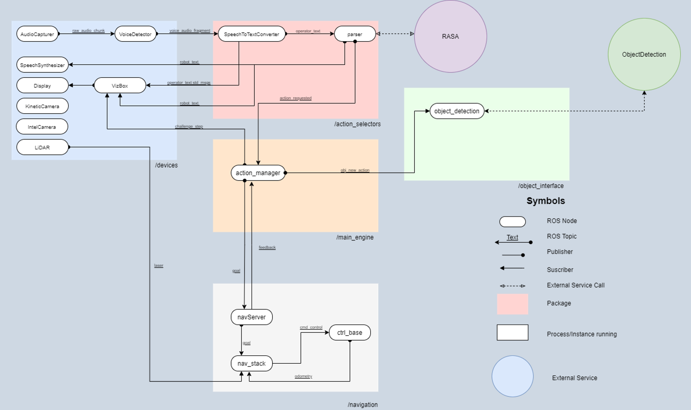

 

# RoBorregos Robocup-Home
This repository contains the development of RoBorregos' robotic solution for [@HOME simulation](https://sites.google.com/view/robocup-athome-sim/competition-at-iros2022?authuser=0), Open Platform League (OPL), where the robot must be capable of interacting with people, manipulate objects and have intelligent responses for everyday home tasks.

See [@HOME Rules](https://drive.google.com/file/d/1Jor8UZXW6xFtBZmMvmZmJlUWtryMW7rQ/view).

## Project setup

1. Clone the project repository on your local machine.

   SSH:

   ```bash
   $ git clone --recurse-submodules https://github.com/RoBorregos/home-simulation.git
   ```

## Project details

This project is made using:
- [ROS Noetic](https://www.ros.org/)
- [Rasa NLU](https://rasa.com/)
- [Tensorflow](https://www.tensorflow.org/learn)
- [PaddlePaddle](https://github.com/paddlepaddle/paddle)
- [Arduino](https://www.arduino.cc/)



For more information about the project system, structure, and development areas you can check our [Official Documentation](https://github.com/RoBorregos/Robocup-Home/wiki).

### Development team

| Name                    | Email                                                               | Github                                                       | Role      |
| ----------------------- | ------------------------------------------------------------------- | ------------------------------------------------------------ | --------- |
| José Cisneros | [joseacisnerosm@gmail.com](mailto:joseacisnerosm@gmail.com) | [@Josecisneros001](https://github.com/Josecisneros001) | PM Software, Integration & Object Manipulation |
| Kevin Vega | [](mailto:) | []() | PM Software, Integration & Speech |
| Victoria García | [](mailto:) | []() | Speech |
| Aldo Samaniego | [aldojesussam0@gmail.com](mailto:aldojesussam0@gmail.com) | [@AldoSamaniego](https://github.com/AldoSamaniego) | Object Detection |
| Jamir Leal | [](mailto:) | []() | Computer Vision |
| Ricardo Chapa | [ricardochaparomero@gmail.com](mailto:ricardochaparomero@gmail.com) | [@RicardoChapaRomero](https://github.com/RicardoChapaRomero) | Human Recognition |
| Andy Salcedo | [andrea2702@gmail.com](mailto:andrea2702@gmail.com) | [@andrea2702](https://github.com/andrea2702) | Navigation |
| Edison Altamirano | [](mailto:) | []() | Navigation |
| Bryan Marquez | [bryanmqz@outlook.com](mailto:) | [https://github.com/BryanMqz]() | Navigation |
| Erasmo Villareal | [](mailto:) | []() | Object Manipulation |
